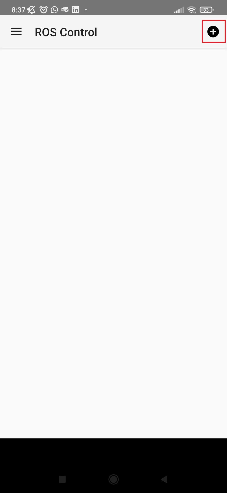
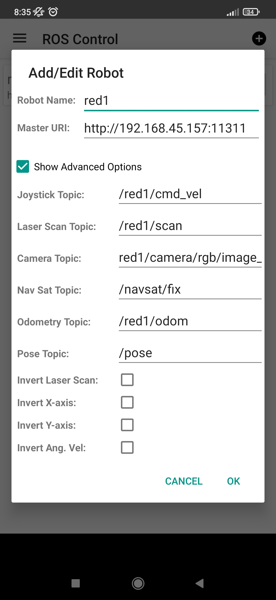

# Team Hunt (PSR - Trabalho3 Grupo1)
Repositório para a partilha de conteúdos relativos ao trabalho prático número 3, realizado no âmbito da Unidade Curricular de Programação de Sistemas Robóticos (PSR) pelos alunos da Universidade de Aveiro:
###### André Vasconcelos (88983);
###### Bruno Mendes (83583);
###### Ivo Bastos (93194);
###### Martín Rivadeneira (104548).

# Indice
 - [Instalação](#instalação)
 - [Ficheiros de descrição do robô](#ficheiros-de-descrição-do-robo)
 - [Launch files de lançamento do robô](#launch-files-de-lançamento-do-robo)
 - [Simulação em Gazebo](#simulação-em-gazebo)
 - [Vizualização do robô em RViz](#vizualização-do-robô-em-rviz)
 - [Manual driving race (Teleop)](#manual-driving-race-teleop)
 - [Seguimento de um Goal (RViz)](#seguimento-de-um-goal-rviz)
 - [Interface do nó driver](#interface-do-no-driver)
 - [Perceção da cena](#perceção-da-cena)
 - [Modo de fuga](#modo-de-fuga)
 - [Modo de perseguição](#modo-de-perseguição)
 - [Evitar obstáculos](#evitar-obstáculos)
 - [Mapeamento do cenário](#mapeamento-do-cenário)
 - [Variabilidade de drivers](#variabilidade-de-drivers)
 - [Árbitro](#arbitro)
 - [Extras](#extras)
 - [Demonstração do jogo](#demonstração-do-jogo)

# Instalação
Como ponto de partida deve certificar-se de que possui o [ROS](http://wiki.ros.org/ROS/Introduction) instalado. Caso necessário, pode consultar um guia de instalação [aqui](http://wiki.ros.org/ROS/Installation). Salientar que, todo o trabalho presente neste repositório fora desenvolvido sobre o sistema [ROS Noetic](http://wiki.ros.org/noetic).

Depois de instalado o ROS, pode efetuar o [dowload do presente repositório](https://docs.github.com/en/repositories/creating-and-managing-repositories/cloning-a-repository). O mesmo contém duas pastas, com três pacotes ROS principais no seu interior, que permitem o controlo de um ou mais robôs com base em duas abordagens/dois códigos distintos.

O pacote [p_bmendes_bringup](https://github.com/bruno5198/Trabalho3-Grupo1/tree/main/p_bmendes/p_bmendes_bringup) (ou [p_mrivadeneira_bringup](https://github.com/bruno5198/Trabalho3-Grupo1/tree/main/p_mrivadeneira/p_mrivadeneira_bringup)) contém um ficheiro onde constam diversos parâmetros necessários ao funcionamento do jogo TeamHunt, um conjunto de ficheiros de configuração do RViz e, por fim, um conjunto de ficheiros do tipo launch files através dos quais é, por exemplo, lançado o ambente de simulação do Gazebo e definido como é efetuado o spawn de cada robô.

O pacote [p_bmendes_description](https://github.com/bruno5198/Trabalho3-Grupo1/tree/main/p_bmendes/p_bmendes_description) (ou [p_mrivadeneira_description](https://github.com/bruno5198/Trabalho3-Grupo1/tree/main/p_mrivadeneira/p_mrivadeneira_description)) contém um conjunto de ficheiros onde é definida a geometria do robô bem como os sensores que o mesmo possui, como é exemplo o sensor de contacto necessário ao funcionamento do jogo TeamHunt. Nos ficheiros em causa são ainda definidas um conjunto de propriedades essenciais, nomeadamente as cores que que poderão ser utilizadas no jogo e que representam, por exemplo, cada uma das três equipas existentes (equipa azul, verde e vermelha).

Por fim, o pacote [p_bmendes_player](https://github.com/bruno5198/Trabalho3-Grupo1/tree/main/p_bmendes/p_bmendes_player) (ou [p_mrivadeneira_player](https://github.com/bruno5198/Trabalho3-Grupo1/tree/main/p_mrivadeneira/p_mrivadeneira_player)) contém o algoritmo desenvolvido e que permite o controlo de um ou mais robôs, tendo sido, portanto, desenvolvidos dois algoritmos distintos.

# Ficheiros de descrição do robo
[Em execução]

# Launch files de lançamento do robo
Para o lançamento não só do robô mas de tudo aquilo que é necessário para a realização do jogo TeamHunt (como, por exemplo, a arena onde decorre o jogo ou o árbitro que monitoriza o mesmo) foi criado o ficheiro [game_bringup.launch](https://github.com/bruno5198/Trabalho3-Grupo1/blob/main/p_bmendes/p_bmendes_bringup/launch/game_bringup.launch) (ou [game_bringup.launch](https://github.com/bruno5198/Trabalho3-Grupo1/blob/main/p_mrivadeneira/p_mrivadeneira_bringup/launch/game_bringup.launch).

Através do ficheiro em causa é possível fazer o spawn de vários robôs, colocando-os em equipas de acordo com o seu nome, através dos parâmetros predefinidos no dicheiro [game.yaml](https://github.com/bruno5198/Trabalho3-Grupo1/blob/main/p_bmendes/p_bmendes_bringup/params/game.yaml) (ou [game.yaml](https://github.com/bruno5198/Trabalho3-Grupo1/blob/main/p_mrivadeneira/p_mrivadeneira_bringup/params/game.yaml) na versão [p_mrivadeneira](https://github.com/bruno5198/Trabalho3-Grupo1/tree/main/p_mrivadeneira)).

Parâmetros como o nome do robô, a sua cor ou a [arena](https://github.com/bruno5198/Trabalho3-Grupo1/tree/main/p_bmendes/th_description) na qual se pretende que decorra o jogo podem ser alterados consoante o pretendido. Para isso basta executar o seguinte comando (para a versão [p_bmendes](https://github.com/bruno5198/Trabalho3-Grupo1/tree/main/p_bmendes)) num terminal, substituindo os campos entre parêntises retos de acordo com o pretendido:

    roslaunch p_bmendes_bringup game_bringup.launch player_name:=[nome] player_color:=[cor] x_pos:=[X axis position] y_pos:=[Y axis position] z_pos:=[Z axis position]

Ou o seguinte comando (para a versão [p_mrivadeneira](https://github.com/bruno5198/Trabalho3-Grupo1/tree/main/p_mrivadeneira)):

    roslaunch p_mrivadeneira_bringup game_bringup.launch player_name:=[nome] player_color:=[cor] visualize:=[visualization] camera_visualize:=[camera visualization] x_pos:=[X axis position] y_pos:=[Y axis position] z_pos:=[Z axis position]

!!!!!!!!!!!!!!!!!!!!!!!!!!!!!!!!!!!!!!!!!!!!!!!!!!!!!!!!!!!!!!!!!!!!!!!!!!!!!!!!
!!!!!!!!!!!!!!!!!! Confirmar se estes coandos estão corretos !!!!!!!!!!!!!!!!!!!
!!!!!!!!!!!!!!!!!!!!!!!!!!!!!!!!!!!!!!!!!!!!!!!!!!!!!!!!!!!!!!!!!!!!!!!!!!!!!!!!

# Simulação em Gazebo
Para a criação de um ambiente simulado, em [Gazebo](http://gazebosim.org/), abra um terminal e corra o seguinte comando (para a versão [p_bmendes](https://github.com/bruno5198/Trabalho3-Grupo1/tree/main/p_bmendes)):

    roslaunch p_bmendes_bringup gazebo.launch

Ou o seguinte comando (para a versão [p_mrivadeneira](https://github.com/bruno5198/Trabalho3-Grupo1/tree/main/p_mrivadeneira)):

    roslaunch p_mrivadeneira_bringup gazebo.launch

!!!!!!!!!!!!!!!!!!!!!!!!!!!!!!!!!!!!!!!!!!!!!!!!!!!!!!!!!!!!!!!!!!!!!!!!!!!!!!!!
!!!!!!!!!!!!!!!!!! Confirmar se este coandos estão corretos !!!!!!!!!!!!!!!!!!!
!!!!!!!!!!!!!!!!!!!!!!!!!!!!!!!!!!!!!!!!!!!!!!!!!!!!!!!!!!!!!!!!!!!!!!!!!!!!!!!!

Este comando fará despoletar o simulador Gazebo, já com o mundo/arena referente ao jogo TeamHunt.

!!!!!!!!! Colocar aqui uma imagem do Gazebo !!!!!!!!!!

# Vizualização do robô em RViz
Para a visualização do robô em [RViz](http://wiki.ros.org/rviz), software de vizualização 3D, e respetios dados associados ao robô, como as imagens captadas pelas câmaras que constituem o robô, a informação referente ao Laserscan captada pelo robô, entre outros, deve correr o seguinte comando, para a versão [p_bmendes](https://github.com/bruno5198/Trabalho3-Grupo1/tree/main/p_bmendes), num terninal:

    roslaunch p_bmendes_bringup visualize.launch

Ou o seguinte comando (para a versão [p_mrivadeneira](https://github.com/bruno5198/Trabalho3-Grupo1/tree/main/p_mrivadeneira)):

    roslaunch p_mrivadeneira_bringup visualize.launch

!!!!!!!!!!!!!!!!!!!!!!!!!!!!!!!!!!!!!!!!!!!!!!!!!!!!!!!!!!!!!!!!!!!!!!!!!!!!!!!!
!!!!!!!!!!!!!!!!!! Confirmar se este coandos estão corretos !!!!!!!!!!!!!!!!!!!
!!!!!!!!!!!!!!!!!!!!!!!!!!!!!!!!!!!!!!!!!!!!!!!!!!!!!!!!!!!!!!!!!!!!!!!!!!!!!!!!

!!!!!!!!! Colocar aqui uma imagem do RViz !!!!!!!!!!

# Manual driving race (Teleop)
Para tornar a condução manual de um robô mais interessante, optou-se por controlar o mesmo com o recurso a um telemóvel que desempenha a função de um joystick. Para isso é necessário a instalação prévia, no seu smartphone, da aplicação [ROS Control](https://play.google.com/store/apps/details?id=com.robotca.ControlApp).

Depois de instalada a referida aplicação, deve ser adicionado um novo robô (como mostra a figura da esquerda), parametrizando-o em função do nome do robô que queremos controlar, do IP do computador onde está a correr a simulação em Gazebo e do nome dos tópicos que pretendemos controlar (como mostra a figura da direita). Posto isto o robô pode então ser controlado, por exemplo, através da função de joystick que a apicação disponibiliza.

Adição de um novo robô     |  Parametrização do robô
:-------------------------:|:-------------------------:
  |  

###### Clique na imagem para ver um pequeno video demonstrativo da condução manual de um robô.
!!!!!!!!! Colocar aqui um vídeo do controlo manual do robô !!!!!!!!!!

**Nota:** Para que seja possível o controlo do robô como descrito anteriormente, é neessário que o computador onde está a correr a simulação em Gazebo e o telemóvel através do qual se pretende controlar o robô estejam na mesma rede.

# Seguimento de um Goal (RViz)
Para o seguimento de um Goal, ao qual se deu precedência sobre os restantes comportamentos do robô (o comportamento de caça e de fuga, por exemplo), fora inicialmente utilizada uma abordagem simplista, visível na versão [p_bmendes](https://github.com/bruno5198/Trabalho3-Grupo1/tree/main/p_bmendes), onde após a definição de um Goal, no RViz, o robô se desloca em linha reta até alcançar esse mesmo Goal, não considerando eventuais obstáculos pelo caminho. No sentido de tornar mais eficiente esta componente, optou-se por uma segunda abordagem, visível na versão [p_mrivadeneira](https://github.com/bruno5198/Trabalho3-Grupo1/tree/main/p_mrivadeneira), em que se recorrera aos [ROS Navigation](http://wiki.ros.org/navigation), permitindo assim que o robô não só se movimentasse em direção a um Goal previamente definido, mas fazendo-o evitando os obstáculos que surgem no seu caminho.

###### Clique na imagem para ver um vídeo referente a uma aula de esclarecimento de dúvidas onde fora abordada esta questão.

# Interface do no driver
Com o intuito de tonar simples a perceção do comportamento do robô em cada instante, foram implementadas algumas "técnicas" como por exemplo, na versão [p_bmendes](https://github.com/bruno5198/Trabalho3-Grupo1/tree/main/p_bmendes), a criação de uma janela através da qual podem ser visualizadas as imagens provenientes das câmaras que o robô possui (uma câmara a apontar para a frente e outra para trás), bem como uma legenda que permite perceber a qual dos robôs corresponde a imagem (bem como qual a sua equipa e adversários), se está a ser detetada alguma presa ou caçador e qual o estado do robô, isto é, se se encontra em modo de fuga, em modo de perseguição ou em modo de procura por uma presa.

!!!!!!!!! Colocar aqui uma imagem !!!!!!!!!!

Na versão [p_mrivadeneira](https://github.com/bruno5198/Trabalho3-Grupo1/tree/main/p_mrivadeneira), fora ainda criada de igual forma uma janela através da qual pode ser visualizada a câmara frontal que o robô possui, janela essa através da qual se consegue ter a perfeita precessão do caminho que o robô terá de percorrer para alcançar um Goal manualmente definido no RViz, como mostra a imagem seguinte.

!!!!!!!!! Colocar aqui uma imagem !!!!!!!!!!

# Perceção da cena
[Em execução]

# Modo de fuga
[Em execução]

# Modo de perseguição
[Em execução]

# Evitar obstáculos
Para evitar obstáculos, foram seguidas duas abordagens. Numa das abordagens, o robô recorre ao sensor [LaserScan](http://docs.ros.org/en/noetic/api/sensor_msgs/html/msg/LaserScan.html) para ter uma perseção daquilo que o rodeia e, considerando que um obstáculo (tipicamente, uma parece) tem sempre um tamanho superior quando comparado com um robô, conseguir afastar-se de um qualquer obstáculo.

Numa segunda abordagem, como referido anteriormente na secção [Seguimento de um Goal (RViz)](#seguimento-de-um-goal-rviz), recorreu-se ao ROS Navigation, onde o robô consegue ir ao encontro de um qualquer objetivo (quer o mesmo seja manualmente definido no RViz, quer corresponda, por exemplo, a uma presa) evitando eventuais obstáculos (podendo esses mesmos obstáculos tratar-se por exemplo, de um caçador).

# Mapeamento do cenário
[Em execução]

# Variabilidade de drivers
Como fora abordado ao longo das secções anteriores, o presente projeto conta com dois drivers distintos, um dos quais se foca na componente de fuga e perseguição e o outro na aquisição da maior quantidade de informação para uma melhor perceção da cena.

# Arbitro
Para a monitorização do jogo, foi implementado um [árbitro](https://github.com/bruno5198/Trabalho3-Grupo1/blob/main/p_bmendes/th_referee/src/th_referee) (código criado pelo professor da Unidade Curricular).
O árbitro pode ser lançado/executado correndo o seguinte comando num terminal:

    rosrun p_bmendes_th_referee th_referee

!!!!!!!!!!!!!!!!!!!!!!!!!!!!!!!!!!!!!!!!!!!!!!!!!!!!!!!!!!!!!!!!!!!!!!!!!!!!!!!!
!!!!!!!!!!!!!!!!!! Confirmar se estes coandos estão corretos !!!!!!!!!!!!!!!!!!!
!!!!!!!!!!!!!!!!!!!!!!!!!!!!!!!!!!!!!!!!!!!!!!!!!!!!!!!!!!!!!!!!!!!!!!!!!!!!!!!!

**Nota:** Na versão [p_mrivadeneira](https://github.com/bruno5198/Trabalho3-Grupo1/tree/main/p_mrivadeneira) basta executar o [game_bringup.launch](https://github.com/bruno5198/Trabalho3-Grupo1/blob/main/p_mrivadeneira/p_mrivadeneira_bringup/launch/game_bringup.launch) que o árbitro já é automaticamente executado.

# Extras
###### Adição de "braços" aos robôs
A adição de "braços" aos robôs tinha como objetivo inicial facilitar o modo de perseguição, sendo que assim que um robô se encontrasse próximo de uma presa "abriria os braços" apanhando/tocando na mesma. Contudo, uma vez que o sensor de contacto se encontra restringido ao corpo do robô, tal abordagem não foi possível. Optou-se assim por dar uma outra utilidade à adição de braços aos robôs, ainda no sentido de facilitar o mode de perseguição. Quando um robô se encontra próximo de uma presa, "abre os braços" numa tentativa de tornar mais difícil a tarefa de fuga da sua presa.

Para que os controladores dos braços dos robôs funcionem é necessário instalar os seguintes pacotes:

 - [Ros control](https://github.com/ros-controls/ros_control);
 - [Ros controllers](https://github.com/ros-controls/ros_controllers).

**Nota:** No pacote "Ros controllers" deve ser apagado o pacote "four_wheel_steering_controller" pois apresenta um erro de compilação.

# Demonstração do jogo
[Em execução]

**
**
